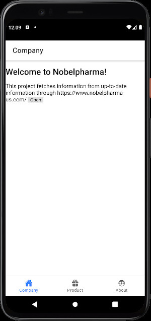

# Plusultra Pharma - Marketing Application

This Smartphone application is for marketing of Plusultra Pharma in Germany and UK. This application makes the products' up-to-date information quickly visible to the customers.

  

# Development
## Development/Build Environment

  * OS: Ubuntu 20.04
  * Platform: Node.js v12.22.11, Ionic v5.4.16, Cordova v11.0.0
  * Android: v6, v5, v.4
  * iOS: ?

        $ sudo npm install -g cordova@11.0.0
        $ sudo npm install -g ionic@5.4.16
        $ sudo npm install -g native-run cordova-res
        $ sudo npm install -g @angular/cli

## Installing Android SDK or Android Studio
* Download Android Studio: https://developer.android.com/studio/index.html#downloads
        $ tar zxvf android-studio-2021.1.1.22-linux.tar.gz

* Reference: Android Studio with Ionic https://ionicframework.com/docs/v5/developing/android

* Configuring Android Emulator

  
  First of all, installing Android SDK.
  
  
  Secondly, installing Android SDK Command Line Tools

  

  Finally, creating an emulator on AVD (https://developer.android.com/studio/run/managing-avds).

* Patching SDK 33

     $ cd Android/Sdk/build-tools/33.0.0-rc2
	 $ ln -vs d8 dx; cd lib; ln -vs d8.jar dx.jar

  
## How to build the application

      ## Installing environments
      $ ionic cordova platform add android@11.0.0
      $ ng add @ionic/cordova-builders
      $ ionic cordova plugin add cordova-plugin-inappbrowser
      $ npm install --save @awesome-cordova-plugins/in-app-browser
      $ npm install --save @awesome-cordova-plugins/core
	  

      ## Building Debug Application
      $ ionic cordova build android
        => platforms/android/app/build/outputs/apk/debug/app-debug.apk

## Launching test instance

      $ ionic serve -d -b -a -s -p 11111

## Testing in emulatr
     
	  $ ionic cordova run android -l

