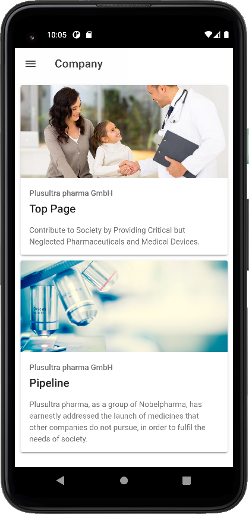
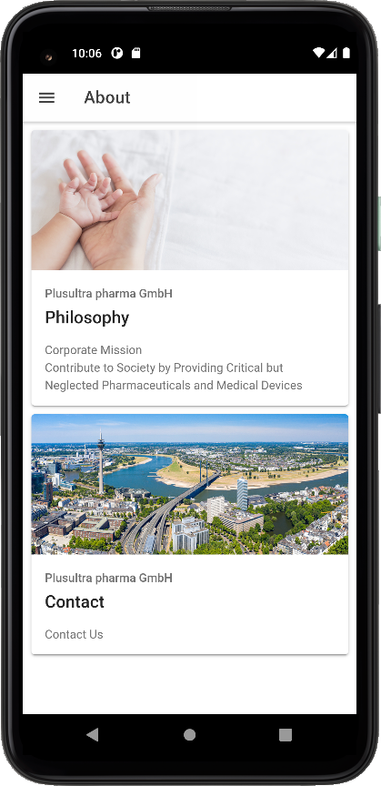

# Plusultra Pharma - Marketing Application

This Smartphone application is for marketing products in Plusultra Pharma in Germany and UK. This application makes the products' up-to-date information quickly visible to the customers.

  

# Development
## Development/Build Environment

  * OS: Ubuntu 20.04
  * Platform: Node.js v12.22.11, Ionic CLI v6.19.0, Cordova v11.0.0
  * Android: v6, v5, v.4
  * iOS: ?

        $ sudo npm install -g cordova@11.0.0
        $ sudo npm install -g ionic@5.4.16
        $ sudo npm install -g native-run cordova-res
        $ sudo npm install -g @angular/cli

## Installing Android SDK or Android Studio
### Android Studio
* Download Android Studio: <https://developer.android.com/studio/index.html#downloads>

        $ tar zxvf android-studio-2021.1.1.22-linux.tar.gz

* Reference: Android Studio with Ionic: <https://ionicframework.com/docs/v5/developing/android>

### Android Emulator
1. Configuring Android Emulator

  
2. Installing Android SDK.
  
  
3. Installing Android SDK Command Line Tools

  

4. creating an emulator on AVD (<https://developer.android.com/studio/run/managing-avds>).

5. Patching SDK 33

        $ cd Android/Sdk/build-tools/33.0.0-rc2
    	$ ln -vs d8 dx; cd lib; ln -vs d8.jar dx.jar

## Ionic Tutorials
* Ionic Icons: <https://ionicframework.com/docs/v3/ionicons/>
* Ionic Modal: <https://www.youtube.com/watch?v=8Sv2Nubc5MQ>

## How to build the application

      ## Installing environments
      $ ionic cordova platform add android@10.0.0
      $ ng add @ionic/cordova-builders
      $ ionic cordova plugin add cordova-plugin-inappbrowser
      $ npm install --save @awesome-cordova-plugins/in-app-browser
      $ npm install --save @awesome-cordova-plugins/core

      ## Updating splash screen (edit resources/*.png)
	  $ npm install cordova-res
	  $ ionic cordova resources

      ## Building Debug Application
      $ ionic cordova build android
        => platforms/android/app/build/outputs/apk/debug/app-debug.apk

## Testing Application

   * Launching test instance

        $ ionic serve -d -b -a -s -p 11111

   * Testing in emulator
     
    	$ ionic cordova run android -l

## Usage of the Marketing Application
The structure of the marketing application is like our company website. But, we can see the web pages using DocList Check and any authentication. We can put any preferable pages to the application preliminary.

### Side Menu
Clicking the top-left button can open the side menu. One can select one of the menus. 

  
  
### Company Screen
The "Company" menu corresponds to the company website's top category, "Home". Once one clicks the "Company" menu, the application shows the main screen of "Company Cards", which are the links to the web pages under the "Home" category.

  

### Web Page
A "Company Card" links to a webpage. So, one can immediately see the webpage.

  
  
### About Screen
The "Company" menu corresponds to the company website's top category, "About".

  
  
  
## Impressum
The Impressum page contains our company information and responsible people and license information of this application.

  

# Change History
* Ver. 0.1 - Side menu. Cordova v11.0.0, Ionic v5.4.16. Android only. Using Nobelpharma US website as a test-bed.

# License
 * Apache 2.0 License
